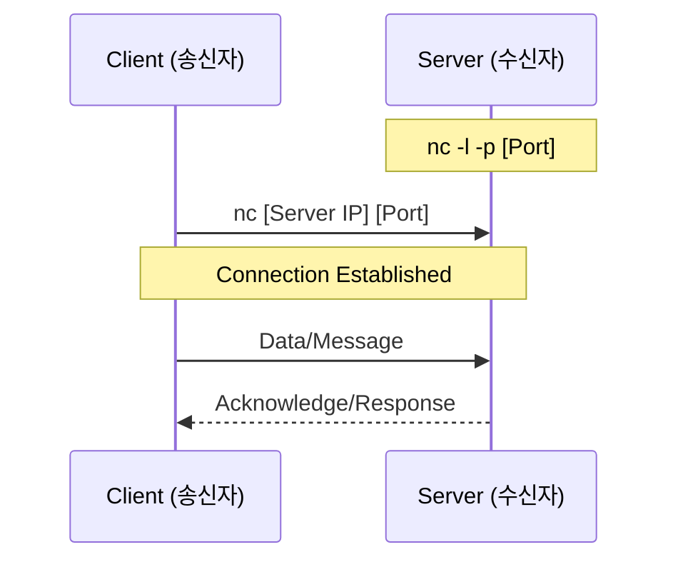

## **네트워크 유틸리티: nc (Netcat)**

---

### **1. nc (Netcat, 넷캣) 정의**
**nc(Netcat)**는 TCP(Transmission Control Protocol, 전송 제어 프로토콜) 또는 UDP(User Datagram Protocol, 사용자 데이터그램 프로토콜) 프로토콜을 사용하여 네트워크 연결을 읽고 쓰는 유틸리티입니다. 네트워크 디버깅, 포트 스캐닝, 데이터 전송 등 다양한 용도로 활용되어 '네트워크의 맥가이버 칼'이라는 별칭을 가지고 있습니다.

* **TCP (Transmission Control Protocol, 전송 제어 프로토콜):** 연결 지향적이며 데이터의 신뢰성을 보장하는 통신 방식입니다.
* **UDP (User Datagram Protocol, 사용자 데이터그램 프로토콜):** 비연결형이며 신속한 전송을 우선시하는 통신 방식입니다.

---

### **2. 주요 옵션 (Main Options)**

| 옵션 | 명칭 및 의미 | 설명 |
| :--- | :--- | :--- |
| **-l** | **Listen (리스닝)** | 서버 모드로 동작하며, 들어오는 연결을 대기합니다. |
| **-p** | **Port (포트)** | 사용할 로컬 포트 번호를 지정합니다. |
| **-v** | **Verbose (버보스)** | 상세한 실행 과정을 화면에 출력합니다. |
| **-z** | **Zero-I/O (제로 I/O)** | 데이터를 보내지 않고 포트가 열려 있는지만 확인합니다. (스캔용) |
| **-u** | **UDP (유디피)** | 기본 TCP 대신 UDP 프로토콜을 사용합니다. |
| **-n** | **Numeric-only (숫자 전용)** | DNS(Domain Name System, 도메인 네임 시스템) 조회를 하지 않고 IP 주소만 사용합니다. |

---

### **3. 주요 활용 사례 (Common Use Cases)**

#### **가. 포트 스캐닝 (Port Scanning)**
특정 서버의 포트가 열려 있는지 확인할 때 사용합니다.
```bash
# 특정 IP의 80번 포트 확인
nc -zv 192.168.1.10 80

# 특정 범위의 포트 스캔 (20번 ~ 80번)
nc -zv 192.168.1.10 20-80
```

#### **나. 간단한 채팅 서버와 클라이언트 (Simple Chat)**
두 장비 간에 간단한 메시지를 주고받을 수 있습니다.
* **Server (수신측):** `nc -l -p 1234`
* **Client (송신측):** `nc [서버IP] 1234`

#### **다. 파일 전송 (File Transfer)**
FTP(File Transfer Protocol, 파일 전송 프로토콜) 없이 파일을 빠르게 보낼 수 있습니다.
* **수신측 (Receiver):** `nc -l -p 1234 > received_file.txt`
* **송신측 (Sender):** `nc [수신측IP] 1234 < original_file.txt`

#### **라. 배너 그래빙 (Banner Grabbing)**
해당 포트에서 구동 중인 서비스의 정보를 확인합니다.
```bash
# 웹 서버 정보 확인 예시
printf "GET / HTTP/1.0\r\n\r\n" | nc [대상IP] 80
```

---

### **4. 도식: nc를 이용한 통신 구조 (NC Communication Structure)**




> **설명:** 서버가 특정 포트를 열고 대기(`-l`)하면, 클라이언트가 해당 IP와 포트로 접속을 시도하여 양방향 데이터 통로를 생성합니다.

---

### **5. 보안 주의사항 (Security Warning)**
`nc`는 강력한 도구이지만, 공격자에 의해 **리버스 쉘(Reverse Shell)** 구성에 악용될 수 있습니다. 인가되지 않은 외부 사용자가 접근할 수 없도록 방화벽(NFW, Network Firewall) 설정을 철저히 관리해야 합니다.

---

**Next Step:** 리버스 쉘 예제, UDP 통신 방법, 포트 스캔 결과 해석
